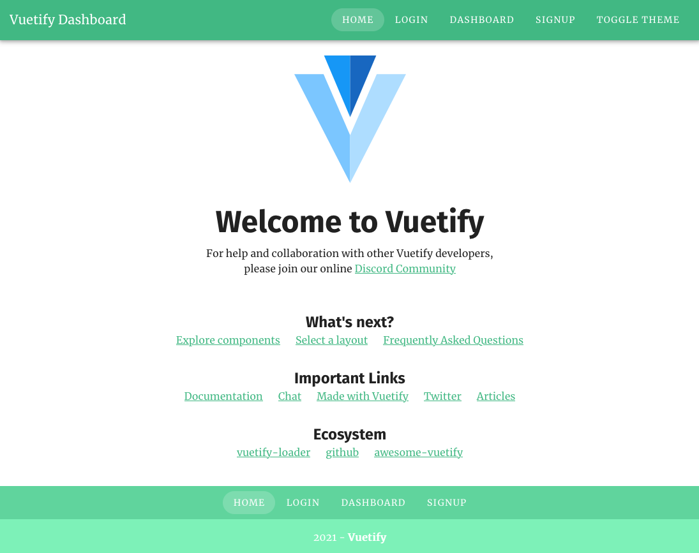
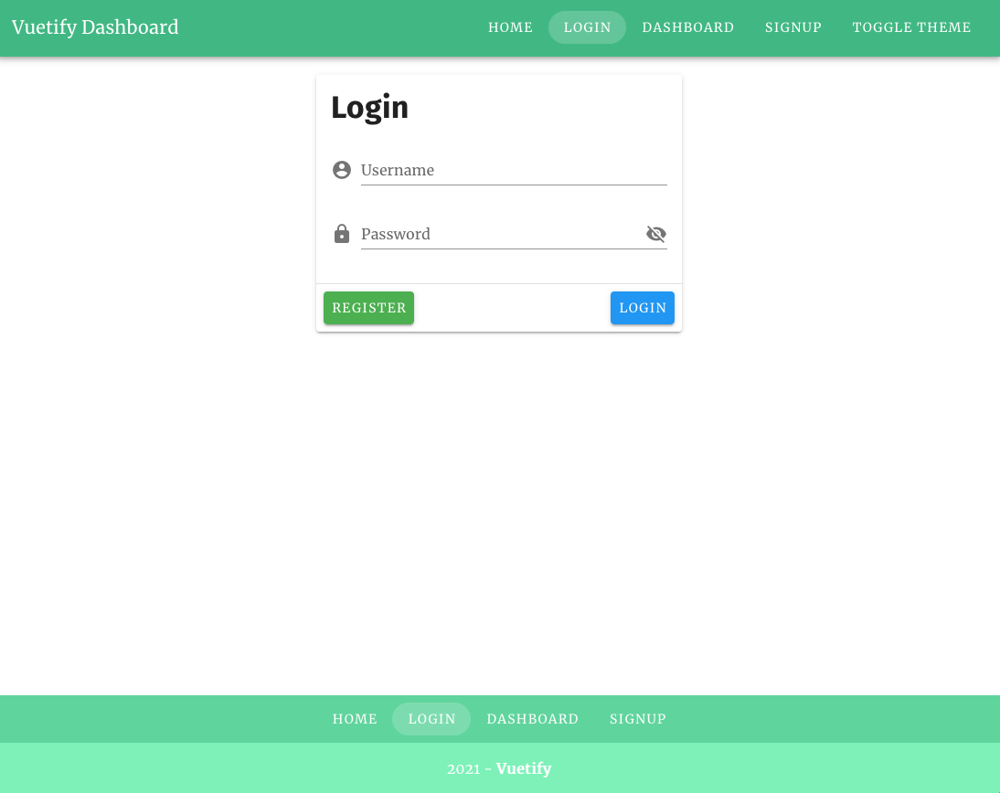
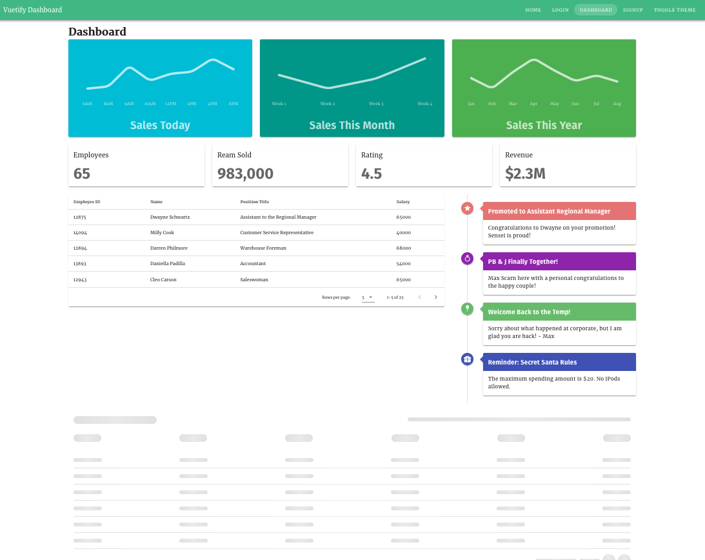
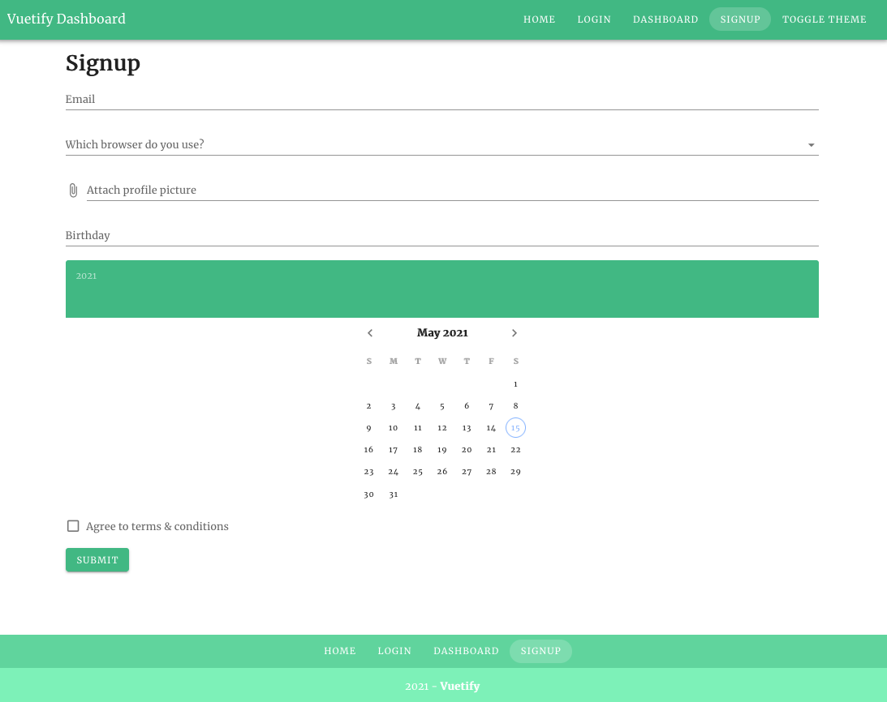
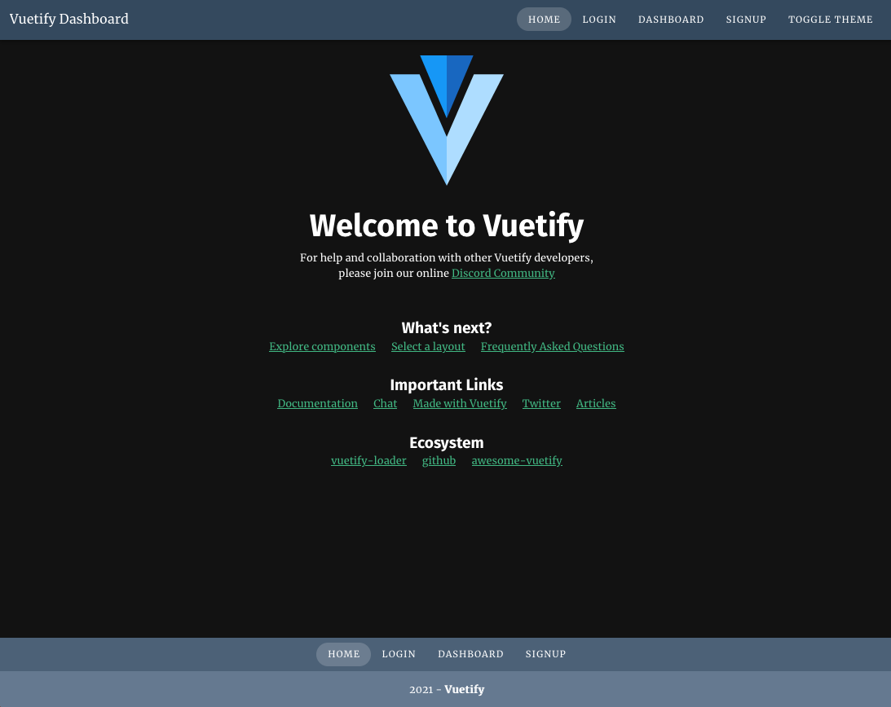
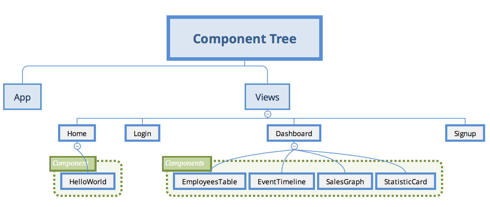

# Vue Todo
This project is based on Ben Hong's [Vue Mastery course on Vuetify](https://www.vuemastery.com/courses/beautify-with-vuetify/getting-started-with-vuetify).

This project is just a shell, without any functionality. The main goal is showing off some of Vuetify features.

As of May 2021, Vuetify does not support Vue 3. Therefore, this entire project was built on Vue 2. However, Vuetify team is working on it and has plans to release a full compatible version by the end of the year.

## Project Overview

The project consists of four _views_, representing the screens available. These screens are home, login, dashboard and signup pages. There is also a toggle theme functionality. 

### Home



The main page (Home), features the `v-app-bar` at the top, representing the toolbar. The `v-content`, representing the main content is in the middle of the page. At the bottom, one can see the `v-footer`. All these components are wrapped by the `v-app`, which is the main container Vuetify uses.

This page has two main responsabilities. First, it shows the navigation components. Vuetify integrates Vue router into its `v-btn` component to enable loading _views_. Second, it enables toggling the current theme.

### Login



This _view_ features a `v-card`, which is Vuetify _card_ component. As expected, it has a title (`v-card-title`) and a body (`v-card-text`). The novelty here is a card container for actions (`v-card-actions`).

In addition to `v-btn`, this page introduces `v-text-field`. This is a form component that groups both label and input text. It also has pre and post icons that are _appended_. These icons may have behaviour attached on it.

Another interesting component is `v-spacer`, used to fill space between `REGISTER` and `LOGIN` buttons. Therefore, both buttons are pushed to the card borders.

### Dashboard



This page shows several layout components. `v-container` is the root component. It is followed by `v-row` and `v-col` - it is unnecessary explaining their goals, right?

As expected, `v-col` has _props_ that enable layout adjusts according to the screen size. 

This page has a `v-snackbar` that shows messages when a table row is clicked. Further on in the course, this page also introduces `v-intersect` directive. This directive enables loading content on-demand.

### Signup



This page introduces several form components. In addition, this page uses Vuetify validation strategy, which I believe is much easier than Vee-validate and  vuelidate. Unfortunately, email validation does not work on my code - I could not figure out the reason.

### Toggle Theme



_Toggle Theme_ enables changing the way page is styled. It is easy to implement and a single change is applied throughout the whole application. Styles can be customised via code or configuration.

## Structure Overview



As this project is just a shell, there is no relationship between components and _views_. Vue router decouples all the interaction set by links.

## Dependencies

This project depends on Vue Router and Vuetify.

## Project setup

```
yarn install
```

```
yarn serve
```
